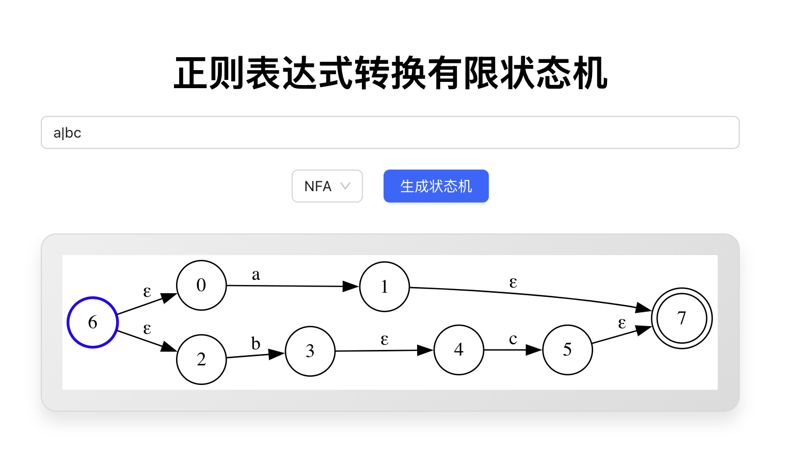
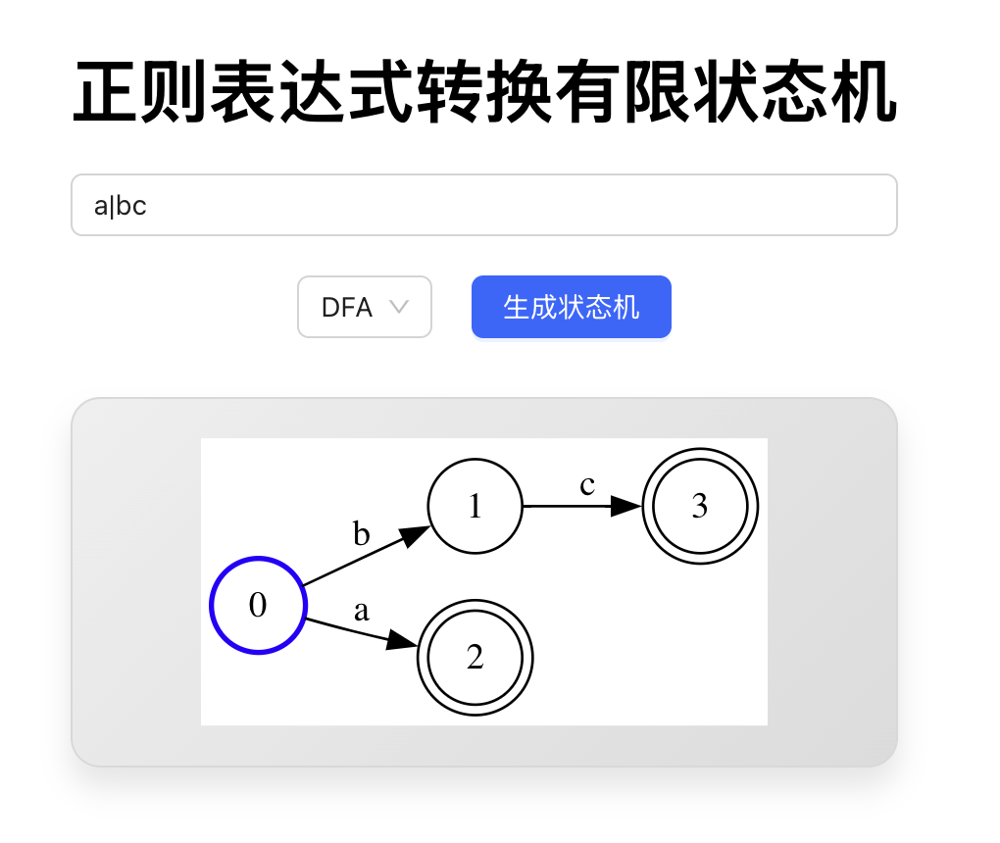
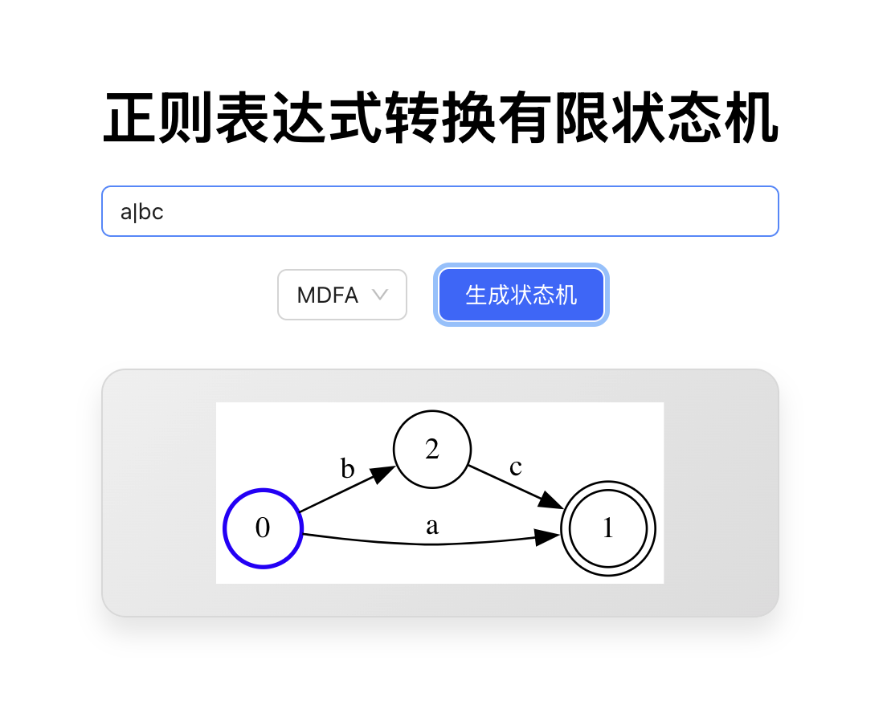

# Regex Trans To FSM


## Function

1. **NFA**
<div style="border: 2px solid black">

</div>
<br/>

2. **DFA**
<div style="border: 2px solid black">

</div>
<br/>

3. **MDFA** (Minimal DFA)
<div style="border: 2px solid black">

</div>
<br/>


## Usage


1. **client**

```bash
cd client
npm install 
npm run dev
```

2. **server**

- [crow](https://crowcpp.org/master/)
- [asio](https://think-async.com/Asio/)
- [cmake](https://cmake.org/)
- [nlohmann json](https://github.com/nlohmann/json)

```bash
brew install crow asio cmake nlohmann-json
```

Ensure the include directory like this, then modify the [`CMakeLists.txt`](./server/CMakeLists.txt)
```
/usr/local/Homebrew/include/
├── asio
├── asio.hpp
├── crow
├── crow.h
├── nlohmann
├── ...
```

```bash
cd server
cmake ..
make -j4
./server
```

